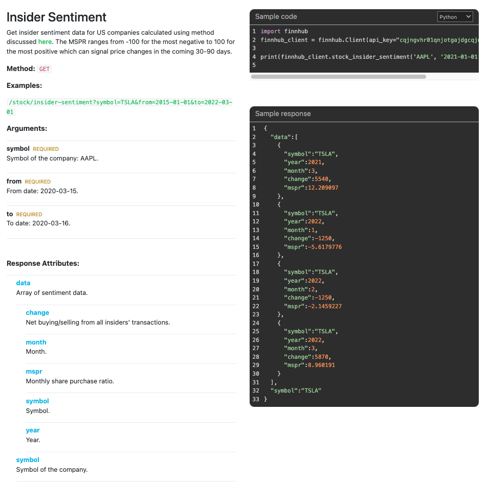
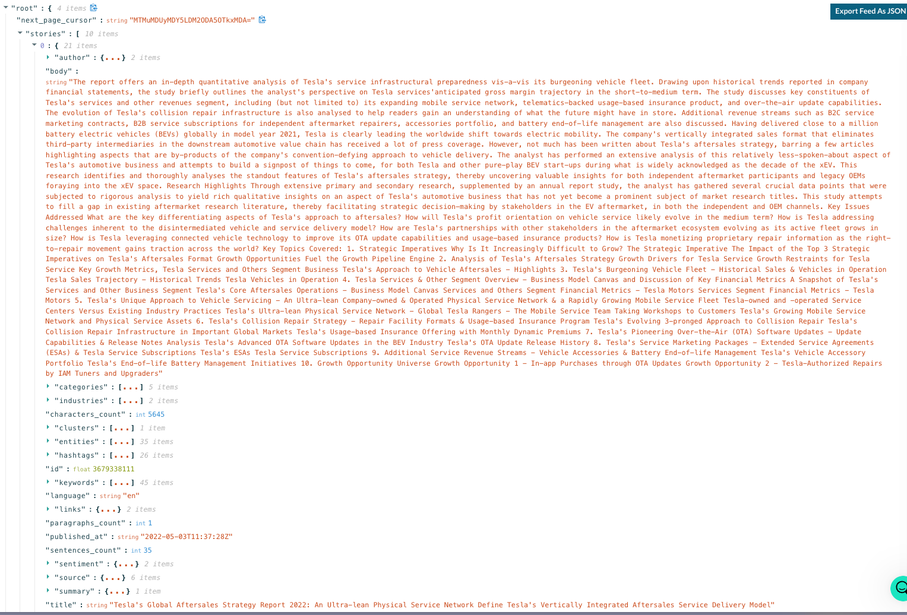

# Monthly Data Analysis of Top Ten Companies

This document provides an analysis of the monthly returns, expected returns, covariance, and correlation of the ten largest companies in the market.

## Data
The data is sourced from `data/condensed_data.csv` and includes the following columns:
- Date
- AAPL
- MSFT
- GOOGL
- AMZN
- NVDA
- FB
- ADBE
- CSCO
- INTC
- ORCL

| Date       | AAPL          | MSFT          | GOOGL        | AMZN          | NVDA          | FB            | ADBE          | CSCO          | INTC          | ORCL          |
|------------|---------------|---------------|--------------|---------------|---------------|---------------|----------------|----------------|----------------|----------------|
| 2017-01-01 | 0.0477466471797487 | 0.0403927749758987 | 0.035005350251831 | 0.09816366280939 | 0.0228592456765301 | 0.1327249358315216 | 0.1013113221403925 | 0.0165454839112542 | 0.0151639976251432 | 0.0431729007407222 |
| 2017-02-01 | 0.1288836440972285 | -0.0103633740495013 | 0.0301637305511321 | 0.026181568550484 | -0.0705259023659771 | 0.0400551386474943 | 0.0437466855232537 | 0.1221839141417344 | -0.016838349890022 | 0.0659887205717595 |
| 2017-03-01 | 0.0532361417725377 | 0.0356248211964564 | 0.0033967253406386 | 0.0491101025739366 | 0.0747681706283669 | 0.0480301762438633 | 0.0996282652507307 | -0.0111175735266355 | 0.0035219236677144 | 0.0474287311671752 |
| 2017-04-01 | -6.967748844688426e-05 | 0.0394776104072742 | 0.0904930795505225 | 0.0433708723351506 | -0.0425042403134547 | 0.0577261300392539 | 0.0277414929293402 | 0.0079882893398981 | 0.0022178424613836 | 0.00784592554697 |
| 2017-05-01 | 0.063418214718188 | 0.0201577190090098 | 0.0676783693185389 | 0.0752764955490703 | 0.3839883895486107 | 0.0080532892769862 | 0.0607147807961061 | -0.066490681921455 | -0.0011065847075207 | 0.0139135489810251 |
| 2017-06-01 | -0.0533227647739127 | -0.0073725927845228 | -0.0581608897038259 | -0.0267639854898061 | 0.002509508769112 | -0.0031692259675846 | -0.0029606525245895 | -0.0072947524526941 | -0.0586816277925715 | 0.1046487357975842 |
| 2017-07-01 | 0.0327039944803948 | 0.0546933074717514 | 0.0170166158773472 | 0.0204339145628873 | 0.1241696754348939 | 0.121009436941774 | 0.0357042064804109 | 0.0047925033858038 | 0.0512745921076676 | -0.0041884612730246 |
| 2017-08-01 | 0.1026691392153453 | 0.0284730469247496 | 0.0103014174874405 | -0.0072688792018283 | 0.0426438358425997 | 0.0160709082463994 | 0.0591849125799226 | 0.0337339053715579 | -0.0112772851725591 | 0.0118137181355371 |
| 2017-09-01 | -0.0565535005745246 | 0.0015630402835407 | 0.0193459032888854 | -0.0196308387510386 | 0.0559925828815484 | -0.0063964999459638 | -0.0385409309434584 | 0.0440856732136021 | 0.0939793627661924 | -0.039340484784715 |

## Expected Returns
The expected returns for each ticker are as follows:

| Ticker | Expected Returns |
|--------|------------------|
| AAPL   | 3.3581853594560784 |
| MSFT   | 3.0354267346240738 |
| GOOGL  | 2.349326224622499  |
| AMZN   | 2.850797417948523  |
| NVDA   | 4.934286481799557  |
| FB     | 1.9751888539936802 |
| ADBE   | 3.2702050426761926 |
| CSCO   | 1.5264345707204214 |
| INTC   | 0.9643754853240227 |
| ORCL   | 1.6904413736044697 |

## Covariance
The covariance matrix is as follows:

|        | AAPL          | MSFT          | GOOGL        | AMZN          | NVDA          | FB            | ADBE          | CSCO          | INTC          | ORCL          |
|--------|---------------|---------------|--------------|---------------|---------------|---------------|----------------|----------------|----------------|----------------|
| AAPL   | 0.0071964372473886035 | 0.002720107701411062 | 0.0023622452318744444 | 0.00381261263231615 | 0.006227756000974188 | 0.004015399972284375 | 0.0039891935215433365 | 0.001911982028771661 | 0.0012888616592813202 | 0.0018475670311088905 |
| MSFT   | 0.002720107701411062 | 0.0027689095215079782 | 0.002141213917743286 | 0.0029501976629430645 | 0.0036555622811116862 | 0.002136384962238099 | 0.0029833140916124593 | 0.0011916998859725814 | 0.0011862032178455526 | 0.0015944871955226763 |
| GOOGL  | 0.0023622452318744444 | 0.002141213917743286 | 0.004094786578925386 | 0.0027138471130045694 | 0.0033473808900807115 | 0.0029974002534978467 | 0.002300195570956841 | 0.0012677276213356155 | 0.0008175659307022003 | 0.0015406578017615642 |
| AMZN   | 0.00381261263231615 | 0.0029501976629430645 | 0.0027138471130045694 | 0.006407580740837567 | 0.005113890281550038 | 0.004068570736978025 | 0.003841375685479021 | 0.0019142222269469818 | 0.0007816903501597401 | 0.0018909223213806148 |
| NVDA   | 0.006227756000974188 | 0.0036555622811116862 | 0.0033473808900807115 | 0.005113890281550038 | 0.01579138538464195 | 0.0044677629695694995 | 0.005544836321507624 | 0.0009907369488206905 | 0.0018868784011346076 | 0.002456175284100993 |
| FB     | 0.004015399972284375 | 0.002136384962238099 | 0.0029974002534978467 | 0.004068570736978025 | 0.0044677629695694995 | 0.006942385534466949 | 0.0036253147496607564 | 0.002004328019677631 | 0.0008509702941797137 | 0.0020529452684747655 |
| ADBE   | 0.0039891935215433365 | 0.0029833140916124593 | 0.002300195570956841 | 0.003841375685479021 | 0.005544836321507624 | 0.0036253147496607564 | 0.005011746028317016 | 0.0017608667669051106 | 0.0014334114479929217 | 0.002153877853311059 |
| CSCO   | 0.001911982028771661 | 0.0011916998859725814 | 0.0012677276213356155 | 0.0019142222269469818 | 0.0009907369488206905 | 0.002004328019677631 | 0.0017608667669051106 | 0.004860582269219783 | 0.0017928782827214696 | 0.0017356748838808977 |
| INTC   | 0.0012888616592813202 | 0.0011862032178455526 | 0.0008175659307022003 | 0.0007816903501597401 | 0.0018868784011346076 | 0.0008509702941797137 | 0.0014334114479929217 | 0.0017928782827214696 | 0.005229615428058618 | 0.0008126332170352571 |
| ORCL   | 0.0018475670311088905 | 0.0015944871955226763 | 0.0015406578017615642 | 0.0018909223213806148 | 0.002456175284100993 | 0.0020529452684747655 | 0.002153877853311059 | 0.0017356748838808977 | 0.0008126332170352571 | 0.003275572467006557 |

Correlation

,AAPL,MSFT,GOOGL,AMZN,NVDA,FB,ADBE,CSCO,INTC,ORCL
AAPL,1.0000000000000002,0.6093586021756892,0.43516160922649133,0.5614574740041031,0.5842015451062278,0.5680880795393966,0.6642503719614707,0.32328152446555297,0.21009351959405603,0.3805378205635235
MSFT,0.6093586021756892,1.0,0.635901778546412,0.7004057271314951,0.5528275640953716,0.48727122553235774,0.8008479527427586,0.3248391506476724,0.3117237117849024,0.5294476776352243
GOOGL,0.43516160922649133,0.635901778546412,1.0000000000000007,0.5298131073799603,0.41627409049541936,0.5621791573116466,0.5077554572981664,0.2841621094989672,0.17667385005420996,0.4206752349315646
AMZN,0.5614574740041031,0.7004057271314951,0.5298131073799603,1.0000000000000002,0.5083867769092473,0.6100149287317106,0.6778681237344869,0.34300556160092516,0.13503701535296547,0.41274615748816634
NVDA,0.5842015451062278,0.5528275640953716,0.41627409049541936,0.5083867769092473,1.0,0.42670294869667813,0.623281285415529,0.1130847636246341,0.20763421502992804,0.34151173747061114
FB,0.5680880795393966,0.48727122553235774,0.5621791573116466,0.6100149287317106,0.42670294869667813,1.0000000000000002,0.6146060437584335,0.34504066700817754,0.14122941474336548,0.43050619100077997
ADBE,0.6642503719614707,0.8008479527427586,0.5077554572981664,0.6778681237344869,0.623281285415529,0.6146060437584335,1.0,0.3567695827303365,0.2799893192448834,0.5315975091378919
CSCO,0.32328152446555297,0.3248391506476724,0.2841621094989672,0.34300556160092516,0.1130847636246341,0.34504066700817754,0.3567695827303365,0.9999999999999997,0.3556082114746716,0.4349913530101284
INTC,0.21009351959405603,0.3117237117849024,0.17667385005420996,0.13503701535296547,0.20763421502992804,0.14122941474336548,0.2799893192448834,0.3556082114746716,1.0000000000000002,0.19634330084717538
ORCL,0.3805378205635235,0.5294476776352243,0.4206752349315646,0.41274615748816634,0.34151173747061114,0.43050619100077997,0.5315975091378919,0.4349913530101284,0.19634330084717538,0.9999999999999998

## Sentiment analysis scores
The expected returns for each ticker are as follows:

| Ticker | Expected Returns |
|--------|------------------|
| AAPL   | 0.1 |
| MSFT   | 0.2 |
| GOOGL  | 0.1  |
| AMZN   | 0.1  |
| NVDA   | 0  |
| FB     | -0.1 |
| ADBE   | -0.2 |
| CSCO   | -0.2 |
| INTC   | 0.6 |
| ORCL   | 0.4 |

## Insider sentiment scores

## plan

Sentiment analysis - raw data

{
    "next_page_cursor": "MTcyMjMwMzk0MDAwMCw3MDAxMTAzMTQz",
    "stories": [
        {
            "author": {
                "id": 3046387
            },
            "body": "Consolidate Pending US Fed Policy Guidance  Bursa Malaysia shares rose on Monday, matching regional gains after a closely watched key US\ninflation data showed easing inflation, raising the odds for interest rate cuts ahead. The FBM KLCI climbed 11.68 points to close at 1,624.56, off an early low of 1,616.35 and high of 1,625.55, as gainers led losers 626 to 455 on total turnover of 4.23bn shares worth RM2.89bn.\n  Supports at 1,615/1,607; Resistance at 1,638/1,640\n  Stocks should consolidate at current levels as investors await earnings from key US technology names and upcoming monetary policy guidance from the US Federal Reserve. Immediate index supports will be at 1,615, 1,607 and 1,583, the respective 30-day, 50-day and 100-day moving average levels, while immediate resistance will be the recent high of 1,638, with 1,640 and 1,660 as tougher upside hurdles.\n  Bargain Gamuda & Sunway Construction\n  Gamuda should attract buyers on weakness for rebound upside, with a confirmed breakout above the 161.8%FP (RM8.19) to aim for the 176.4%FP (RM8.54) and 200%FP (RM9.10) ahead, and key uptrend supports from the rising 30-day ma (RM7.31) and 50-day ma (RM6.80). SunCon will need convincing breakout above the 150%FP (RM5.19) to target the 161.8%FP (RM5.46) and 176.4%FP (RM5.80) going forward, with uptrend supports from the 30-day ma (RM4.37) and 50-day ma (RM3.94) cushioning downside.\n  Asian Markets Rebound on Rate-Cut Optimism\n  Stocks in Asia rebounded on Monday after a key U.S. inflation report late last Friday raised hopes for an interest rate cut. The inflation report showed personal income rose by less than expected, while personal spending increased in line with economist estimates. Another report also showed that consumer sentiment in the U.S. deteriorated less than previously estimated in July. The Fed is likely to signal its plans to cut in September at the conclusion of its meeting on Wednesday, according to economists surveyed by Bloomberg News, a move they say will kick off reductions each quarter through 2025. Money markets are fully pricing a September move, with a chance of two more by year-end, according to swaps data compiled by Bloomberg. A raft of earnings including Apple Inc., Amazon.com Inc and Microsoft Corp. will also be parsed for clues about the health of the world's largest economy.\n  Elsewhere in Asia, Chinese factory activity data is due this week, providing further insight into a surprise People's Bank of China rate cut to boost a flailing economy. Australian inflation data will also be keenly awaited as traders' debate whether the nation's central bank will hike its key rate as early as next week. Japan's Nikkei 225 jumped 2.13% to finish at 38,468.63, while the broad-based Topix added 2.23% to 2,759.67. Australia's S&P/ASX 200 gained 0.86% to 7,989.60 and South Korea's Kospi rose 1.30% to 2.767.53. Hong Kong Hang Seng index also gained 1.28% to finish at 17,238.34, while the Shanghai Composite added 0.03% to 2,891.85.\n  Wall Street Subdued Ahead of Big Tech Earnings\n  Wall Street's main indexes were mostly flat in choppy trading overnight as traders awaited high-profile corporate results and the Federal Reserve's monetary policy meeting this week. The Dow Jones Industrial Average lost 0.12% to end at 40,539.93. The S&P 500 inched up by 0.08% to 5,463.54 and the Nasdaq Composite added 0.07% to 17,370.20. The choppy trading on Wall Street comes as traders seem reluctant to make significant moves ahead of the big tech earnings and Federal Reserve's monetary policy meeting this week. This week's earnings slate will play a role in determining whether tech stocks can now bounce back from last week's declines. Another key event this week will be the Federal Reserve meeting, with the central bank set to release a new policy statement on Wednesday.\n  The Fed is not expected to cut interest rates this week, but traders will be looking for clues as to how likely the central bank is to make a move at its September meeting. On Friday investors will focus on the July non-farm payrolls report for signs of possible weakening in the labor market. Among the S&P 500's 11 major industry sector indexes consumer discretionary was boosted by Tesla as the electric vehicle maker's stock rallied after Morgan Stanley named the electric vehicle stock a top pick. On Semiconductor advanced 11.5% after reporting better-than-expected earnings and revenue.\n  Source: TA Research - 30 Jul 2024",
            "categories": [
                {
                    "id": "IAB13",
                    "label": "Personal Finance",
                    "score": 0.53,
                    "links": {
                        "self": "https://api.aylien.com/api/v1/classify/taxonomy/iab-qag/IAB13"
                    }
                },
                {
                    "id": "IAB13-11",
                    "label": "Stocks",
                    "score": 0.42,
                    "links": {
                        "parents": [
                            "https://api.aylien.com/api/v1/classify/taxonomy/iab-qag/IAB13"
                        ],
                        "self": "https://api.aylien.com/api/v1/classify/taxonomy/iab-qag/IAB13-11"
                    }
                },
                {
                    "id": "04000000",
                    "label": "economy, business and finance",
                    "score": 0.07,
                    "links": {
                        "self": "https://api.aylien.com/api/v1/classify/taxonomy/iptc-subjectcode/04000000"
                    }
                },
                {
                    "id": "04019000",
                    "label": "finance (general)",
                    "score": 0.07,
                    "links": {
                        "parents": [
                            "https://api.aylien.com/api/v1/classify/taxonomy/iptc-subjectcode/04000000"
                        ],
                        "self": "https://api.aylien.com/api/v1/classify/taxonomy/iptc-subjectcode/04019000"
                    }
                },
                {
                    "id": "ay.econ",
                    "label": "Economics",
                    "score": 0.8,
                    "links": {
                        "self": "https://api.aylien.com/api/v1/classify/taxonomy/aylien/ay.econ"
                    }
                },
                {
                    "id": "ay.econ.monetary",
                    "label": "Monetary Policy",
                    "score": 0.8,
                    "links": {
                        "parents": [
                            "https://api.aylien.com/api/v1/classify/taxonomy/aylien/ay.econ.policy"
                        ],
                        "self": "https://api.aylien.com/api/v1/classify/taxonomy/aylien/ay.econ.monetary"
                    }
                },
                {
                    "id": "ay.econ.policy",
                    "label": "Economic Policy",
                    "score": 0.8,
                    "links": {
                        "parents": [
                            "https://api.aylien.com/api/v1/classify/taxonomy/aylien/ay.econ",
                            "https://api.aylien.com/api/v1/classify/taxonomy/aylien/ay.pol.govpol"
                        ],
                        "self": "https://api.aylien.com/api/v1/classify/taxonomy/aylien/ay.econ.policy"
                    }
                },
                {
                    "id": "ay.fin",
                    "label": "Finance",
                    "score": 0.8,
                    "links": {
                        "self": "https://api.aylien.com/api/v1/classify/taxonomy/aylien/ay.fin"
                    }
                },
                {
                    "id": "ay.fin.intrates",
                    "label": "Interest Rates",
                    "score": 0.8,
                    "links": {
                        "parents": [
                            "https://api.aylien.com/api/v1/classify/taxonomy/aylien/ay.fin"
                        ],
                        "self": "https://api.aylien.com/api/v1/classify/taxonomy/aylien/ay.fin.intrates"
                    }
                },
                {
                    "id": "ay.gov.ecoissue",
                    "label": "Economic Issues",
                    "score": 0.8,
                    "links": {
                        "parents": [
                            "https://api.aylien.com/api/v1/classify/taxonomy/aylien/ay.pol.issues"
                        ],
                        "self": "https://api.aylien.com/api/v1/classify/taxonomy/aylien/ay.gov.ecoissue"
                    }
                },
                {
                    "id": "ay.pol",
                    "label": "Politics and Government",
                    "score": 0.8,
                    "links": {
                        "self": "https://api.aylien.com/api/v1/classify/taxonomy/aylien/ay.pol"
                    }
                },
                {
                    "id": "ay.pol.govpol",
                    "label": "Government Policy",
                    "score": 0.8,
                    "links": {
                        "parents": [
                            "https://api.aylien.com/api/v1/classify/taxonomy/aylien/ay.pol"
                        ],
                        "self": "https://api.aylien.com/api/v1/classify/taxonomy/aylien/ay.pol.govpol"
                    }
                },
                {
                    "id": "ay.pol.issues",
                    "label": "Political Issues",
                    "score": 0.8,
                    "links": {
                        "parents": [
                            "https://api.aylien.com/api/v1/classify/taxonomy/aylien/ay.pol.politics"
                        ],
                        "self": "https://api.aylien.com/api/v1/classify/taxonomy/aylien/ay.pol.issues"
                    }
                },
                {
                    "id": "ay.pol.politics",
                    "label": "Politics",
                    "score": 0.8,
                    "links": {
                        "parents": [
                            "https://api.aylien.com/api/v1/classify/taxonomy/aylien/ay.pol"
                        ],
                        "self": "https://api.aylien.com/api/v1/classify/taxonomy/aylien/ay.pol.politics"
                    }
                }
            ],
            "characters_count": 4452,
            "clusters": [
                610592487
            ],
            "entities": [
                {
                    "id": "Q53536",
                    "links": {
                        "wikipedia": "https://en.wikipedia.org/wiki/Federal_Reserve",
                        "wikidata": "https://www.wikidata.org/wiki/Q53536"
                    },
                    "types": [
                        "Organization",
                        "Financial_institution",
                        "Bank",
                        "Government_agency",
                        "Business"
                    ],
**                    "overall_sentiment": {
                        "polarity": "neutral",
                        "confidence": 0.78
                    },**